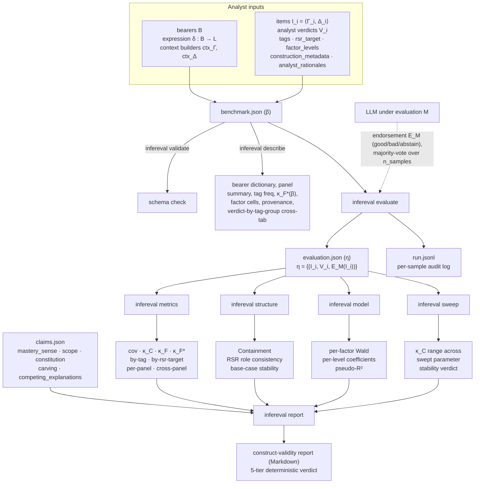

# Architecture

A single dataflow diagram for the whole framework, plus a brief tour of
each component. The narrative version is in [Concepts](concepts.md);
this page is for readers who want to see the wiring at a glance.

## Dataflow

## Layer-by-layer tour

### Layer 1 — analyst inputs

Everything the framework consumes is **analyst-supplied**:

- **Bearers `B`**, an expression function `δ : B → L`, and context-construction
  functions `ctx_Γ`, `ctx_Δ`. Together they determine how implications get
  presented to the model. See the paper's Definition 1.
- **Items**, each a single-bearer-succedent implication `⟨Γ_i, {ψ_i}⟩`
  paired with a verdict tuple `V_i = (v_{i,1}, …, v_{i,m})` from the
  analyst panel. Optional richer metadata — tags, `rsr_target`,
  `factor_levels`, `construction_metadata`, `analyst_rationales` — feeds
  the construct-validity layer.

### Layer 2 — the benchmark `β`

`benchmark.json` packages the analyst inputs as a Pydantic-validated
artifact. Two entry points without ever calling a model:

- **`infereval validate`** — schema + cross-field validation. Pure check.
- **`infereval describe`** — comprehensive inspector: bearer dictionary,
  per-analyst verdict distribution, `κ_F*(β)` baseline (when defined),
  tag frequency, factorial-design coverage, paraphrase-variant count,
  per-panel summaries, construction-provenance roll-up, and the
  verdict-by-tag-group cross-tab. Run it first on any new benchmark.

### Layer 3 — evaluate `M` on `β`

**`infereval evaluate`** drives the model `M` through every item,
sampling `n_samples` verdicts via a verification prompt and computing
`E_M` by majority vote (tie-break configurable; default `abstain`).
Outputs:

- **`η`** (`evaluation.json`) — the evaluation artifact: the benchmark's
  items plus `M`'s verdicts, with a tamper-evident `benchmark_hash` for
  integrity.
- **`run.jsonl`** — per-sample audit log: prompt hash, raw response,
  parsed verdict, usage, timing, finish reason, reasoning tokens. One
  event per provider call.

### Layer 4 — the four analytical commands

All four take `η` (and usually `β`) and emit JSON. They're designed to
compose: each addresses a distinct construct-validity axis, and the
report (layer 5) consumes all four together.

| Command | Question it answers | Output |
|---|---|---|
| `infereval metrics` | How well does `M` agree with the analysts? | `cov`, `κ_C`, `κ_F`, `κ_F*` + by-tag / by-rsr-target / per-panel / cross-panel decompositions |
| `infereval structure` | Does the derived frame ⟨B, I_M⟩ exhibit the structural properties the inferentialist framework treats as constitutive of mastery? | Containment check, RSR role consistency, base-case stability, per-item anomaly list |
| `infereval model` | Which declared `factors` actually differentiate `M`'s behaviour? | Logistic regression of per-sample agreement with item-clustered SEs; per-factor joint Wald + per-level coefficients |
| `infereval sweep` | Are the headline metrics robust to the framework parameters chosen? | Re-runs `metrics` across a swept parameter; reports a deterministic stability verdict on the `κ_C` range |

### Layer 5 — the construct-validity report

**`infereval report`** combines a `claims.json` file (the analyst's
explicit declarations about mastery sense, scope, constitution, carving,
and which competing-explanation checks were run) with the four analytical
artifacts above. It emits a Markdown report ending in a deterministic
five-tier verdict (`Strongly substantiated` → `Insufficient`) computed by
[`compute_verdict()`](api.md). The verdict consults the artifacts, not
just the self-report booleans — structural anomalies and `m<2` panels cap
the verdict at `partially_defensible` per the v0.5.3 audit-cap rules.

## What this diagram doesn't show

- **The Hlobil–Brandom layer** — `Definition 3` of the paper specifies
  `⟨B, I_M⟩` as the derived frame; the framework guarantees Containment
  by construction (clause i). RSR, ≈, implicational roles, conceptual
  content all live on top of `⟨B, I_M⟩` and aren't separately materialised
  in code (`DerivedFrame.contains()` is the lazy gateway).
- **Replay / mock providers** — `ReplayProvider` and `ScriptedProvider`
  occupy the `M` slot in the diagram for deterministic CI / quickstart;
  the structure is identical, only the provider differs.
- **The paraphrase axis** — `infereval evaluate --paraphrase-variant K`
  or `--paraphrase-cycle` re-runs the same benchmark with `δ` substituted
  per variant. Drops into the diagram at layer 3, producing per-variant
  `η` files that feed independent metrics / structure / model / sweep
  runs.
